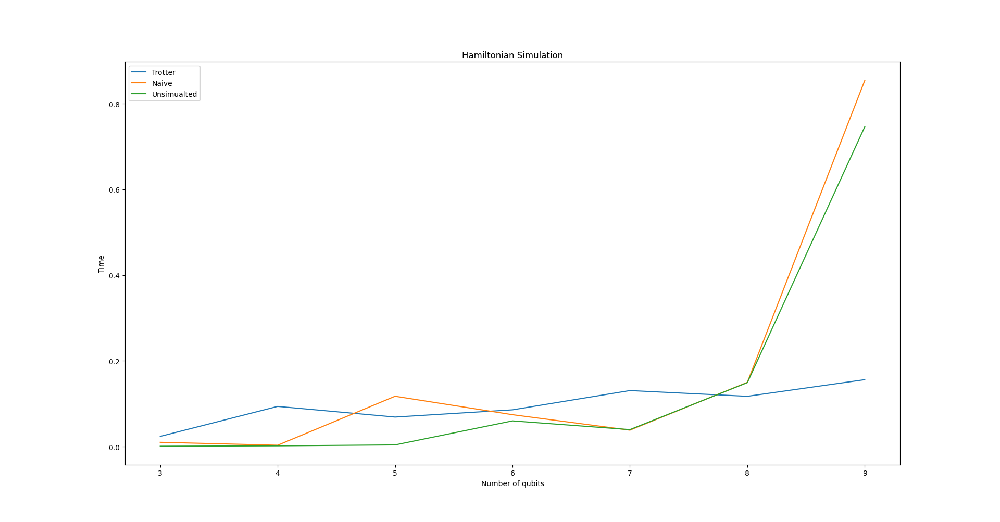
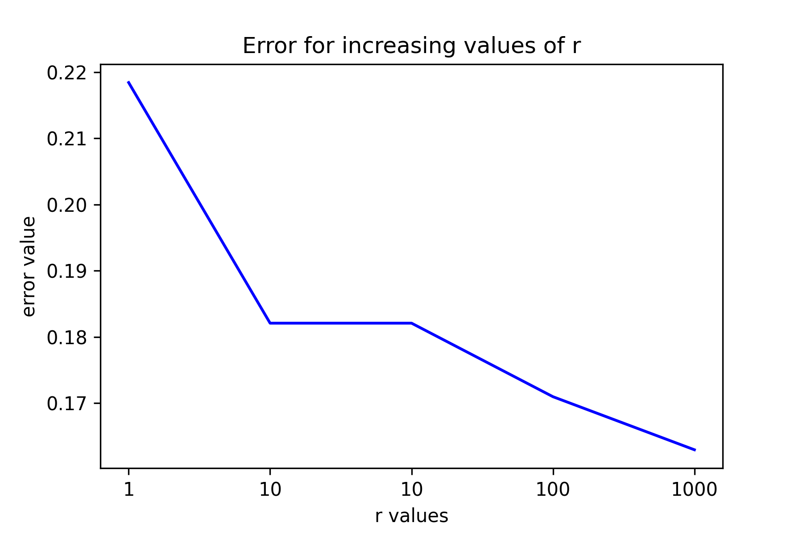

# Fast Hamiltonian Simulation

**Team Name**: PauliZ

We simulated the Hamiltonian of the Heisenberg Spin Chain model using topologically optimized Trotterisation on a 7-qubit IBM quantum computer. We then compare the results of this simulation with purely-classical Hamiltonian simulation and classically Trotterised Hamiltonian simulation.

## IBM’s Quantum Simulation

It was required to check how well Trotter’s method performs in terms of an error on an actual computer with the computed naive method. The error rate clearly goes down even for a noisy quantum computer.

As $r$ increases, the number of gates increases which means that the error rate grows. But due to a better approximation of larger $r$ values, the overall error rate becomes lesser even for a noisy quantum computer.

### References

[1] Richard P Feynman (1982). ["Simulating physics with computers"](http://www.sciencemag.org/cgi/content/abstract/273/5278/1073) International Journal of Theoretical Physics

[2] [Bell, J. S.](https://en.wikipedia.org/wiki/John_Stewart_Bell) (1964). ["On the Einstein Podolsky Rosen Paradox"](https://cds.cern.ch/record/111654/files/vol1p195-200_001.pdf). *[Physics Physique Физика](https://en.wikipedia.org/wiki/Physics_Physique_%D0%A4%D0%B8%D0%B7%D0%B8%D0%BA%D0%B0)*. **1** (3): 195–200. [doi](https://en.wikipedia.org/wiki/Doi_(identifier)):[10.1103/PhysicsPhysiqueFizika.1.195](https://doi.org/10.1103%2FPhysicsPhysiqueFizika.1.195)

[3] [Dominic W. Berry](https://arxiv.org/search/quant-ph?searchtype=author&query=Berry%2C+D+W) et al. (2015) [Simulating Hamiltonian dynamics with a truncated Taylor series](https://journals.aps.org/prl/abstract/10.1103/PhysRevLett.114.090502) Phys. Rev. Lett. 114, 090502

[4] [Andrew M. Childs](https://arxiv.org/search/quant-ph?searchtype=author&query=Childs%2C+A+M) et al. (2021)Theory of Trotter Error with Commutator Scaling, Phys. Rev. X 11, 011020
